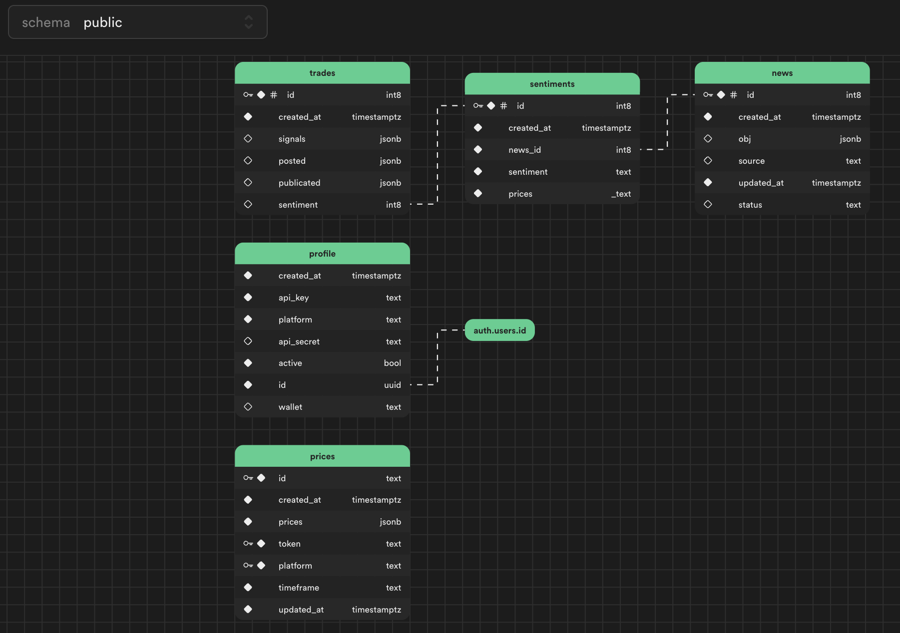
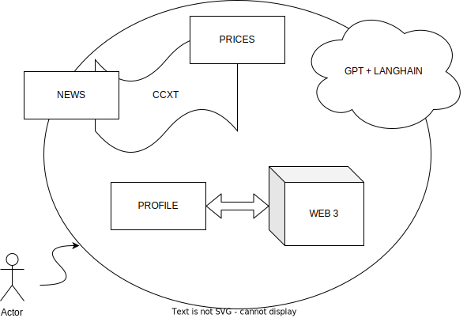

# NEWS TRADE
Trading based on sentiment analysis. The system fetches news for analysis, retrieves data from provided links (web pages only), extracts annotations for the news (for more focused analysis). It enables Web3 subscription signals for monetization and self-sustainability of the service (addressing liquidity concerns).

## Install
Installation and Setup: Provide detailed instructions for installing and running the frontend, agents, describe the structure, and the web3 smart contract.

## Blockchain
1. Installation
```
cd blockchain
npm install
```
2. compile smartcontract
```
npx hardhat compile
```
3. start local blockchain
```
npx hardhat node 
```


## Frontend
The frontend is located in the news-trade folder. It consists of a React application connected to the database via REST and provides real-time mechanisms (from the database to the frontend). It is recommended to use Node.js version > 15.

1. Installation: 
```
cd web
npm install
```
2. Running:
```
npm start
```
Also you need specify `contractAddress` in WalletCard.js

## Backend
1) Database
We utilize a cloud-based service for providing database fulfillment. The database management system is Postgresql. Interaction with the database is facilitated through PostgREST. It serves as the primary data repository and a cloud-based vector database.

Additional Notes:
- TimeScaleDb (for storing time series) - currently disabled.
- Vector storages are disabled (with plans for future development).

## Agents
Agents are provided in the "agents" folder and are small Python programs that run autonomously and provide some utility.

### Functional Agents:
- agents.news - news parsing and updating the list of news in the database.
- agents.prices - prices of cryptocurrencies used in the news (or to be more precise, all possible pairs).
- agents.sentiment - sentiment analysis of news as positive, negative, or neutral - updating in the database (under development).
- agents.trade - proxy agent for creating trades on cryptocurrency exchanges (under development).

## Technolics & Services
### Coding
1. Python3.9+, Multiprocessing
2. Node.js 15+, JavaScript, React
### Infra
3. Supabase
4. Docker (plan)
5. Cubernates (plan)
### Blockchain
4. Web3 Etherium
### AI
5. OpenAI ChatGPT
6. YandexGPT2.0 (preview)
7. FinGPT, FinRL
### DS
7. Cryptopanic
8. ⚙️ Langchain 🦜

Current versions as of today. If you have any questions or uncertainties, please write them in the Issues section.

## Project Structure:

### Database:



### Project files:
The files are located in a single subfolder, with the remaining parts grouped inside.

```bash
.
├── agents
│   ├── langchain
│   ├── news
│   │   ├── ... .py
│   ├── prices
│   │   └── agent.py
│   ├── requirements.txt
│   ├── sentiment
│   │   └── agent.py
│   └── trade
│       └── agent.py
├── contracts
│   └── contract.sol
├── docs
│   ├── imgs
│   │   └── schema.svg
│   └── schema.drawio
├── news-trade
│   ├── src
│   ├── ...
└── readme.md
```



## Usage Examples:
Registered, paid for the subscription, connected the exchange, and the agent executes buy and sell orders with stop-loss and take-profit option. Turning off the signals doesn't stop active deductions. When turned back on, signals resume.

## Configuration
1. Fill in the .env file.
2. Parameters required for the service are intuitively understandable.

## Certainly, you can create issues and everything else.
Welcome!

## LICENCE
```
      GNU AFFERO GENERAL PUBLIC LICENSE
        Version 3, 19 November 2007
```
Developers: 
- [Aleksey Savin](https://alekseysavin.com), [Alexander Belov](https://baadev.com/)
